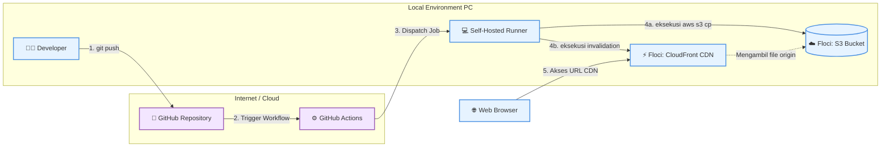

# 🚀 Local AWS Static Website Deployment (S3)

Proyek ini adalah simulasi infrastruktur cloud untuk melakukan _deployment_ website statis menggunakan layanan AWS S3. Untuk menghindari biaya layanan cloud (_cloud-cost free_), proyek ini sepenuhnya dijalankan secara lokal menggunakan **Floci** (AWS Local Emulator) yang di-hosting melalui Docker.

## 🛠️ Tech Stack

- **Emulator:** Floci (via Docker Compose)
- **Layanan Cloud (Simulasi):** AWS S3 (Simple Storage Service)
- **Alat CLI:** AWS CLI v2
- **Web Server:** S3 Static Website Hosting

## 📋 Prasyarat

Sebelum menjalankan proyek ini, pastikan sistem kamu sudah memiliki:

1.  **Docker Desktop** (dengan dukungan Virtualisasi / WSL 2 aktif).
2.  **AWS CLI v2** terinstal.
3.  Terminal (PowerShell/Bash).

---

## 🚀 Panduan Instalasi & Deployment

### 1. Menjalankan Emulator Floci

Pertama, kita perlu menghidupkan server AWS lokal menggunakan Docker.
Buat file `docker-compose.yml` di dalam direktori proyek:

```yaml
services:
  floci:
    image: floci/floci:latest
    ports:
      - "4566:4566"
    volumes:
      - ./data:/app/data
      - /var/run/docker.sock:/var/run/docker.sock
Jalankan container di latar belakang (detached mode):
```
Bash
docker compose up -d
Tunggu beberapa saat hingga Floci siap menerima permintaan (cek status via docker compose logs floci).

### 2. Konfigurasi Kredensial AWS (Dummy)
Karena Floci meniru lingkungan AWS asli, AWS CLI tetap membutuhkan konfigurasi identitas. Jalankan perintah berikut dan masukkan data dummy:
```
Bash
aws configure
AWS Access Key ID: test

AWS Secret Access Key: test

Default region name: us-east-1

Default output format: json
```
### 3. Membuat S3 Bucket
Buat wadah penyimpanan (S3 Bucket) baru dengan nama portofolio-ku. Kita arahkan langsung endpoint ke server Floci (127.0.0.1:4566):
```
Bash
aws --endpoint-url [http://127.0.0.1:4566](http://127.0.0.1:4566) s3 mb s3://portofolio-ku
```
### 4. Konfigurasi Static Website Hosting
Secara default, S3 hanya menyimpan file. Ubah pengaturan bucket menjadi web server yang membaca index.html sebagai halaman utama:
```
Bash
aws --endpoint-url [http://127.0.0.1:4566](http://127.0.0.1:4566) s3 website s3://portofolio-ku/ --index-document index.html
```
### 5. Deployment Website (Upload)
Siapkan file index.html proyekmu, kemudian unggah (deploy) ke dalam bucket S3 lokal tersebut menggunakan perintah copy (cp):
```
Bash
aws --endpoint-url [http://127.0.0.1:4566](http://127.0.0.1:4566) s3 cp index.html s3://portofolio-ku/index.html
```
### 6. Akses Website
Setelah berhasil diunggah, website statis kamu sudah live di server lokal dan bisa diakses melalui browser pada alamat berikut:
👉 http://portofolio-ku.s3-website.localhost.localstack.cloud:4566

## 🏛️ Arsitektur Sistem


### 7. Konfigurasi CDN & Invalidasi Cache (Bonus)
Proyek ini mengimplementasikan AWS CloudFront untuk mendistribusikan lalu lintas secara lebih cepat. Pipeline CI/CD diatur agar otomatis melakukan pembersihan memori (*cache invalidation*) setiap kali ada file web baru yang diunggah.
